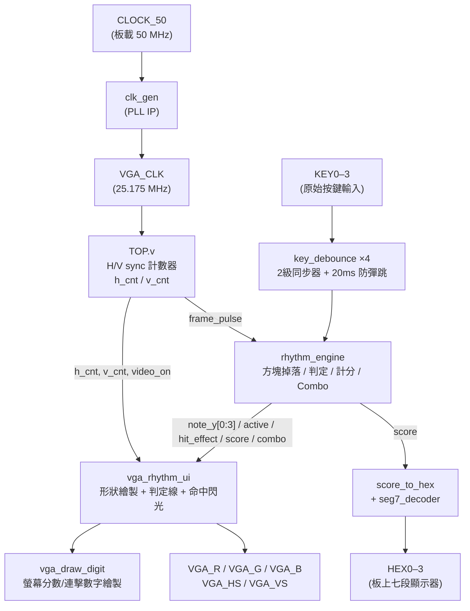

# FPGA VGA Rhythm Game — 節奏敲擊遊戲

-blue)


## 📌 專案簡介 (Overview)

本專案在 **Terasic DE10-Standard**（Intel Cyclone V SX, `5CSXFC6D6F31C6`）開發板上，
以純手刻 **Verilog RTL** 實作一個 4 軌節奏敲擊遊戲：畫面完全由自製的 VGA 時序產生器
驅動（無使用任何 HDMI/VGA IP 或軟核 CPU），方塊沿 4 條軌道往下掉落，玩家需在判定區內按下
對應按鍵擊中方塊以得分、累積連擊（Combo），分數同時顯示在畫面左上角（VGA 動態繪製數字）與
板上 4 顆七段顯示器上。

這門課是「可規劃程式設計」Lab 7，此專案的重點是練習：VGA 時序自製、非同步按鍵防彈跳、
有限狀態的遊戲邏輯設計，以及多模組整合的 RTL 架構。

---

## ⚙️ 規格摘要 (Key Specifications)

| 項目 | 內容 |
| :--- | :--- |
| **開發板 (Board)** | Terasic DE10-Standard — Intel Cyclone V SX, `5CSXFC6D6F31C6` |
| **語言 / 工具鏈** | Verilog HDL / Intel Quartus Prime |
| **顯示輸出** | VGA 640×480 @ 60 Hz，H/V sync 由 RTL 計數器自行產生（無現成 IP） |
| **像素時脈** | 板載 50 MHz 經 PLL (`clk_gen`) 產生 25.175 MHz VGA 時脈 |
| **按鍵輸入** | 4 顆按鍵，經 2 級同步器 + 20 ms 確認延遲防彈跳 |
| **遊戲邏輯** | 4 軌方塊掉落、判定區命中偵測、得分／連擊(Combo)計數、漏接偵測 |
| **分數顯示** | 螢幕上動態繪製數字（`vga_draw_digit`）＋ 板上 4 顆七段顯示器（HEX0–3） |

---

## 🏛️ 系統架構 (System Architecture)



### 模組說明 (Module Breakdown)

| 檔案 | 說明 |
| :--- | :--- |
| [`TOP.v`](rtl/TOP.v) | 頂層模組：VGA 時序計數（H/V sync、blanking）、模組間接線整合 |
| [`clk_gen.v`](rtl/clk_gen.v) | PLL IP wrapper，50 MHz → 25.175 MHz VGA 像素時脈 |
| [`key_debounce.v`](rtl/key_debounce.v) | 2 級同步器 + 20 ms 計數確認，消除按鍵彈跳與 metastability |
| [`rhythm_engine.v`](rtl/rhythm_engine.v) | 遊戲核心：4 軌方塊下落速度控制、判定區命中偵測、得分/連擊/漏接邏輯 |
| [`vga_rhythm_ui.v`](rtl/vga_rhythm_ui.v) | 畫面繪製：4 種軌道形狀（矩形/菱形/三角形/正方形）、判定線、命中閃光效果 |
| [`vga_draw_digit.v`](rtl/vga_draw_digit.v) | 以掃描線座標比較方式，在畫面上繪製 7 段風格數字（供分數/Combo 顯示） |
| [`seg7_decoder.v`](rtl/seg7_decoder.v) | 二進位轉七段顯示器編碼（含 `score_to_hex` 整合模組），驅動板上 HEX0–3 |

---

## 🎮 遊戲玩法 (Gameplay)

- 4 條軌道各對應一顆按鍵（KEY0–3），方塊以固定速度往下掉落
- 每條軌道方塊形狀不同：🔴 矩形 / 🔵 菱形 / 🟡 三角形 / 🟣 正方形，方便辨識
- 方塊進入畫面中段的**判定區**時按下對應按鍵即算命中：分數 +1、連擊 +1，並觸發白色閃光特效
- 若方塊掉出畫面底部仍未被擊中，視為漏接，連擊歸零
- 分數同時顯示在畫面左上角（VGA 繪製）與板上七段顯示器；連擊顯示在畫面右上角

📹 **實機 Demo 影片**(點檔名可在 GitHub 上直接線上播放):
- [docs/media/IMG_8434.mov](docs/media/IMG_8434.mov)
- [docs/media/IMG_8435.mov](docs/media/IMG_8435.mov)

<!--
📸 更輕量的動圖/截圖仍待補：
建議用線上工具（例如 ezgif.com/video-to-gif）把上面任一支影片剪成 5~8 秒的 docs/demo.gif，
放在 README 最上方最吸睛（教授不用點擊、直接自動播放）。存好後把下面這行的註解拿掉即可自動顯示：


-->

---

## 📂 專案結構 (Repository Structure)

```
FPGA-VGA-Rhythm-Game/
├── rtl/                        # 手刻 Verilog 原始碼 + Quartus 專案檔
│   ├── TOP.v
│   ├── clk_gen.v                (PLL wrapper)
│   ├── key_debounce.v
│   ├── rhythm_engine.v
│   ├── seg7_decoder.v
│   ├── vga_draw_digit.v
│   ├── vga_rhythm_ui.v
│   └── lab7.qpf / lab7.qsf      (Quartus 專案檔，可直接以 Quartus 開啟)
├── docs/                        # 架構圖／截圖／demo 動圖存放處
├── report/                      # (選填) 課堂書面報告
└── README.md
```

---

## 🔧 如何開啟專案 (How to Open in Quartus)

1. 安裝 [Intel Quartus Prime](https://www.intel.com/content/www/us/en/software-kit/programmable/quartus-prime/prime-lite.html)（Lite 版即可，需支援 Cyclone V）
2. `File` → `Open Project` → 選擇 `rtl/lab7.qpf`
3. `Processing` → `Start Compilation` 進行合成與燒錄檔產生
4. 透過 USB-Blaster 將 `.sof` 燒錄至 DE10-Standard 板上即可執行

---

## 👤 作者 (Author)

可規劃程式設計 Lab 7 — Block Touch Game
