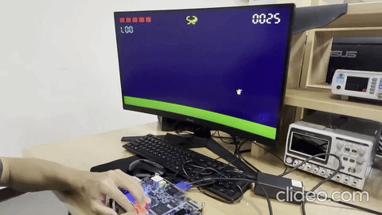
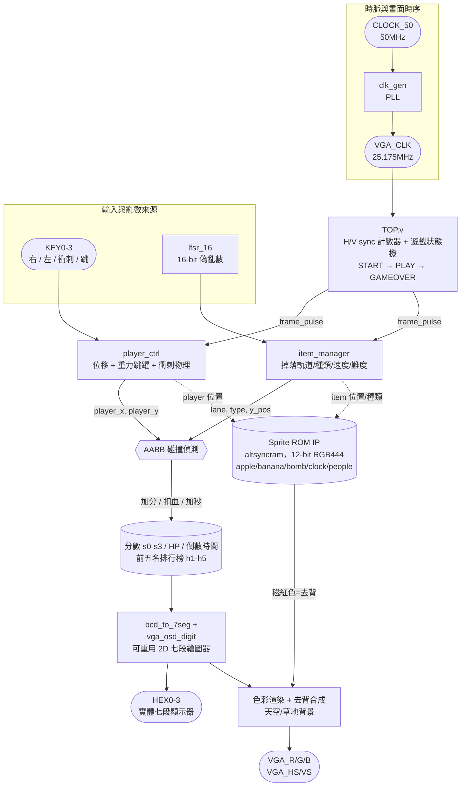

# FPGA VGA Fruit Dash — 接水果生存遊戲

-blue)




## 📌 專案簡介 (Overview)

本專案在 **Terasic DE10-Standard**（Intel Cyclone V SX, `5CSXFC6D6F31C6`）開發板上，
以純手刻 **Verilog RTL** 實作一款帶物理引擎的生存類接物遊戲：主角可左右移動、拋物線跳躍、
瞬間衝刺，畫面上方隨機掉落蘋果（+5 分）、香蕉（+10 分）、時鐘（+5 秒）與炸彈（扣 1 滴血），
接到炸彈會觸發 1 秒無敵閃爍，時間或血量歸零則進入結算畫面並顯示本機前三名排行榜。

所有角色與道具都不是幾何圖形，而是**真實照片經 Python 轉檔成 12-bit RGB444 點陣圖**，
燒錄進 Quartus 的 ROM IP（altsyncram）後，由 RTL 即時讀出繪製在螢幕上，並用去背色做透明合成。

VGA 時序與 FSM 遊戲狀態機、簡易物理引擎、LFSR 動態難度調配、點陣圖 ROM 去背渲染、以及可重用的
2D 七段顯示器繪圖工具模組——這些都是自己額外鑽研、自主學習補上的，不是課堂內容直接教的東西。

### 🏆 專案亮點

- 🎮 完整遊戲迴圈：START 選單 → PLAY 遊戲進行 → GAMEOVER 結算與排行榜
- 🏃 手刻物理引擎：拋物線重力跳躍 + 下沿偵測觸發的瞬間衝刺位移
- 🎲 動態難度系統：16-bit LFSR 偽亂數驅動掉落物種類/軌道，速度與炸彈機率隨等級即時調高
- 🖼️ 真實照片轉點陣圖：12-bit RGB444 ROM + 磁紅色去背，讓角色道具無縫疊在背景上
- 🔍 內嵌 SignalTap 邏輯分析儀節點，可即時擷取 VGA 時序與按鍵訊號除錯
- 🏆 跨局保存的前五名排行榜，結算畫面依名次彩色分階顯示

---

## ⚙️ 規格摘要 (Key Specifications)

| 項目 | 內容 |
| :--- | :--- |
| **開發板 (Board)** | Terasic DE10-Standard — Intel Cyclone V SX, `5CSXFC6D6F31C6` |
| **語言 / 工具鏈** | Verilog HDL / Intel Quartus Prime |
| **顯示輸出** | VGA 640×480 @ 60 Hz，H/V sync 由 RTL 計數器自行產生 |
| **像素時脈** | 板載 50 MHz 經 PLL (`clk_gen`) 產生 25.175 MHz VGA 時脈 |
| **角色/道具繪圖** | 5 張真實照片轉檔的 12-bit RGB444 點陣圖，存於 Quartus ROM IP 中即時讀取 |
| **物理引擎** | 左右平移、衝刺瞬移（40px）、拋物線跳躍（初速 -15，重力 +1/frame） |
| **隨機與難度** | 16-bit LFSR 偽亂數 → 掉落物軌道/種類；速度與炸彈機率隨等級動態調高 |
| **遊戲狀態機** | START（等待任意鍵）→ PLAY → GAMEOVER（結算 + 前三名排行榜）|
| **除錯方式** | 內嵌 SignalTap 邏輯分析儀節點（即時擷取 VGA 時序與按鍵訊號） |

---

## 🏛️ 系統架構 (System Architecture)



### 模組說明 (Module Breakdown)

| 檔案 | 說明 |
| :--- | :--- |
| [`TOP.v`](rtl/TOP.v) | 頂層模組：VGA 時序、遊戲狀態機（START/PLAY/GAMEOVER）、碰撞判定、計分/血量/倒數邏輯、前五名排行榜、畫面渲染整合 |
| [`clk_gen.v`](rtl/clk_gen.v) | PLL IP wrapper，50 MHz → 25.175 MHz VGA 像素時脈 |
| [`player_ctrl.v`](rtl/player_ctrl.v) | 玩家物理引擎：左右移動、下沿偵測觸發的瞬間衝刺（40px）、拋物線重力跳躍 |
| [`item_manager.v`](rtl/item_manager.v) | 掉落物管理：呼叫 `lfsr_16` 決定軌道與種類，依當前等級動態調整掉落速度與炸彈生成機率 |
| [`lfsr_16.v`](rtl/lfsr_16.v) | 16-bit 線性回饋移位暫存器（XOR taps 16/14/13/11），產生偽亂數 |
| [`bcd_to_7seg.v`](rtl/bcd_to_7seg.v) | 內含兩個模組：BCD→七段解碼器，以及可重用的 `vga_osd_digit`——用幾何座標比較在 VGA 畫面上「畫」出虛擬七段數字 |
| [`apple.v` / `banana.v` / `bomb.v` / `clock.v` / `people.v`](rtl/) | Quartus IP Wizard 產生的 `altsyncram` 單埠 ROM，各自搭配同名 `.mif` 點陣圖資料（見下方素材管線） |

---

## 🎮 操作方式 (Controls)

| 按鍵 | 選單畫面 | 遊戲中 |
| :--- | :--- | :--- |
| KEY0 | 任意鍵開始/返回選單 | 向右移動 |
| KEY1 | 任意鍵開始/返回選單 | 向左移動 |
| KEY2 | 任意鍵開始/返回選單 | **瞬間衝刺**：搭配方向鍵瞬移 40px |
| KEY3 | 任意鍵開始/返回選單 | **跳躍**：初速 -15，重力持續 +1/frame |
| SW9（reset_n）| 硬體重置 | 清空所有狀態，含前三名排行榜 |

**掉落物效果**：🍎 蘋果 +5 分　🍌 香蕉 +10 分　⏰ 時鐘 +5 秒　💣 炸彈 -1 滴血（觸發 1 秒無敵閃爍）

---

## ✨ 遊戲特效 (Special Effects)

- **受傷無敵閃爍**：撞到炸彈扣血後進入 60 幀（1 秒）無敵，期間主角以 15Hz 頻率閃爍提示
- **倒數危急警告**：剩餘時間 < 10 秒時，畫面上的時間數字從黃色自動切換為鮮紅色
- **死亡灰階特效**：結算畫面中，主角點陣圖被強制覆蓋成灰階陰影色，呈現「戰敗」視覺效果
- **智慧去背合成**：點陣圖背景雜色在轉檔時全部歸一成磁紅色（`12'hF0F`），RTL 讀到這個色碼時即時透出草地/天空背景，物件邊緣不會有生硬色塊
- **前三名彩色分階排行榜**：結算畫面依名次分別以金🥇/銀🥈/銅🥉配色顯示歷史最高分
- **復古街機 OSD 對話框**：開始畫面顯示青色 "PRESS" 提示，結算畫面顯示紅色 "END"，皆由 `vga_osd_digit` 即時繪製

---

## 🖼️ 素材管線 (Sprite Pipeline)

角色與道具並非用 RTL 畫幾何圖形拼出來，而是直接用真實照片：

<table>
<tr>
<td align="center"><br>人物</td>
<td align="center"><br>蘋果 +5</td>
<td align="center"><br>香蕉 +10</td>
<td align="center"><br>時鐘 +5秒</td>
<td align="center"><br>炸彈 -1血</td>
</tr>
</table>

轉檔流程：照片 → Python 腳本將 24-bit 色彩壓縮成 FPGA 好處理的 **12-bit RGB444**，並用飽和度/亮度
容差判定把背景棋盤格或雜色邊緣全部強制抹成純磁紅色（`12'hF0F`）當作去背色 → 輸出 `.mif` 記憶體
初始檔 → 燒錄進 Quartus `altsyncram` ROM IP → RTL 讀到磁紅色就自動透出背景，讀到其他值就直接輸出點陣圖色彩。

---

## 📹 實機 Demo 影片

- [docs/media/IMG_8431.mp4](docs/media/IMG_8431.mp4)
- [docs/media/IMG_8434.mov](docs/media/IMG_8434.mov)
- [docs/media/IMG_8435.mov](docs/media/IMG_8435.mov)

---

## 📂 專案結構 (Repository Structure)

```
FPGA-VGA-Fruit-Dash/
├── rtl/                          # 手刻 Verilog 原始碼 + Quartus 專案檔 + Sprite ROM IP
│   ├── TOP.v
│   ├── player_ctrl.v
│   ├── item_manager.v
│   ├── lfsr_16.v
│   ├── bcd_to_7seg.v             (含 vga_osd_digit)
│   ├── clk_gen.v                 (PLL wrapper)
│   ├── apple.v / banana.v / bomb.v / clock.v / people.v   (ROM wrapper)
│   ├── apple.mif / banana.mif / bomb.mif / clock.mif / people.mif  (點陣圖資料)
│   └── lab6.qpf / lab6.qsf       (Quartus 專案檔，可直接以 Quartus 開啟)
├── docs/
│   ├── sprites/                  # 角色/道具原始照片
│   └── media/                    # Demo 動圖與影片
└── README.md
```

---

## 🔭 已知限制與未來規劃 (Known Limitations & Future Work)

- **排行榜不會斷電保存**：`h1`~`h5` 是暫存器，只在板子通電期間有效，重新燒錄或斷電就會清空；
  之後可以接 EEPROM/Flash 做真正跨電源的持久化儲存
- **分數用獨立 BCD 位數暫存器手動進位**：目前 `s0`~`s3` 各自處理進位邏輯，之後可以改用通用的
  Double Dabble（shift-add-3）演算法，讓二進位轉 BCD 更容易擴充位數
- **缺少對應目前腳位的 testbench**：手上原本的模擬環境是舊版介面留下來的，跟現在的 `TOP.v`
  埠列對不上，之後想加自動化驗證的話需要重寫一份

---

## 🔧 如何開啟專案 (How to Open in Quartus)

1. 安裝 [Intel Quartus Prime](https://www.intel.com/content/www/us/en/software-kit/programmable/quartus-prime/prime-lite.html)（Lite 版即可，需支援 Cyclone V）
2. `File` → `Open Project` → 選擇 `rtl/lab6.qpf`
3. `Processing` → `Start Compilation` 進行合成與燒錄檔產生
4. 透過 USB-Blaster 將 `.sof` 燒錄至 DE10-Standard 板上即可執行

---

## 👤 作者 (Author)

**CHEN SHUO HU**

RTL、VGA 時序、遊戲邏輯與素材轉檔管線皆為個人獨立設計與實作。
